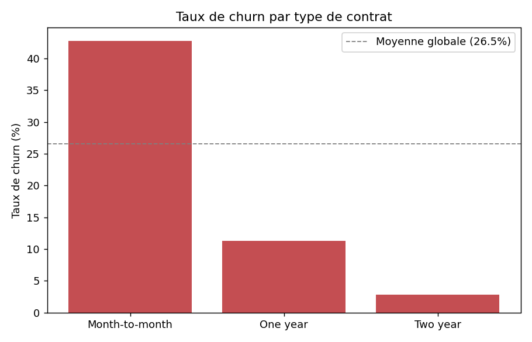
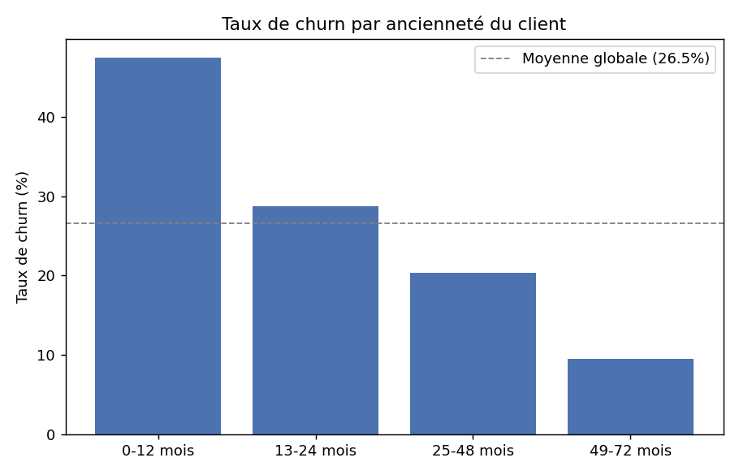
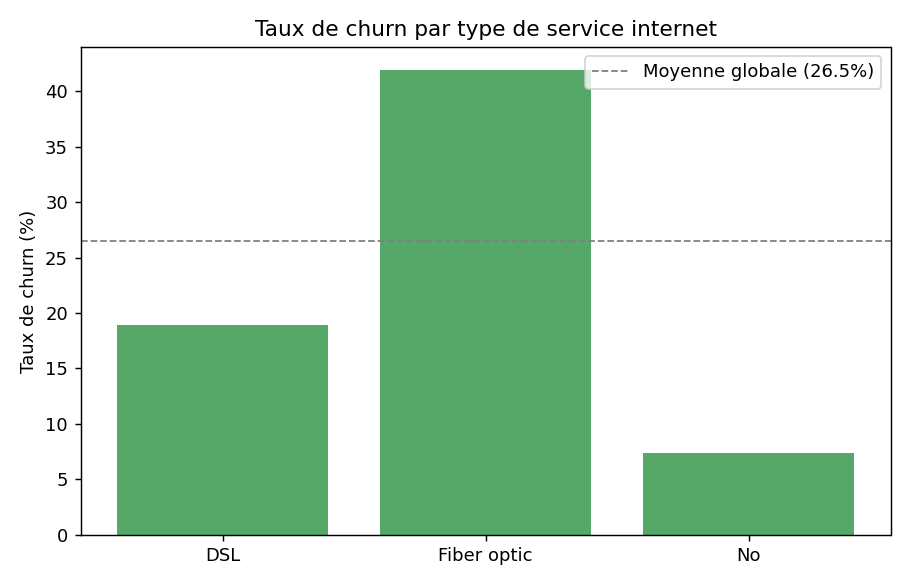

# Où se concentre le risque de départ client ?

## En bref
Plutôt que de construire un modèle prédictif (déjà fait sur un principe voisin dans [scoring-prospects-b2b](https://github.com/ATEYABA-K/scoring-prospects-b2b)), j'ai voulu ici répondre à une question plus simple mais tout aussi utile pour prioriser une action de rétention : **dans quels segments de clients le churn est-il concentré ?** Jeu de données public (Telco Customer Churn, IBM, ~7 000 clients) : un opérateur télécom fictif, mais des vrais mécanismes de résiliation à analyser.

## Reproduire
```bash
python3 analyse_churn.py
```

## Les résultats

Taux de churn global : **26,5 %**.



Le type de contrat est de loin le facteur le plus discriminant : **42,7 %** de churn en contrat mensuel, contre **11,3 %** en engagement 1 an et seulement **2,8 %** en engagement 2 ans. Un client sans engagement a 15 fois plus de risque de partir qu'un client engagé sur 2 ans.



Le risque décroît avec l'ancienneté : **47,4 %** de churn sur les 12 premiers mois, contre **9,5 %** au-delà de 4 ans. Les nouveaux clients sont donc la population la plus fragile, cohérent avec le facteur contrat, puisque les nouveaux clients sont aussi ceux les plus souvent en contrat mensuel.



Moins intuitif : les clients en fibre optique churnent presque autant que la moyenne des mensuels (**41,9 %**), largement plus que les clients DSL (**19 %**). Une hypothèse (pas vérifiée dans ce jeu de données) : la fibre coûte plus cher (74,44 € de charge mensuelle moyenne chez les clients qui partent, contre 61,27 € chez ceux qui restent) : un client qui paie plus cher a aussi plus de raisons de comparer les offres concurrentes.

## Ce que je ferais avec ce résultat, si c'était une vraie entreprise
Prioriser la rétention sur les nouveaux clients en contrat mensuel avec fibre, c'est le croisement des 3 facteurs les plus à risque, pas un facteur pris isolément.

## Ce que cette analyse ne fait pas
Elle ne dit pas *pourquoi* la fibre churne plus (juste une hypothèse, pas testée), et elle ne priorise pas des clients individuels comme le ferait un modèle de scoring, juste des segments. Elle ne remplace pas un modèle prédictif, elle répond à une question différente et plus simple à interpréter pour une décision rapide.

Alvin Kouadio
